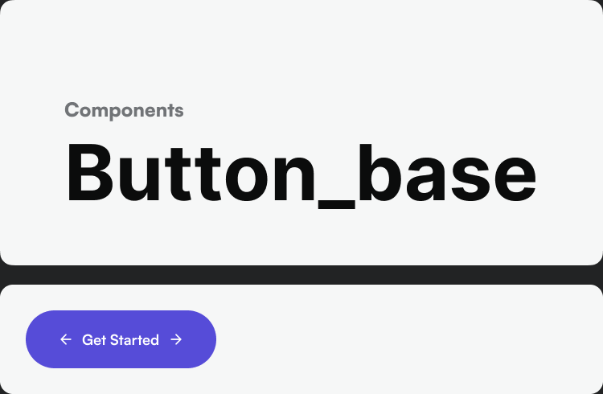
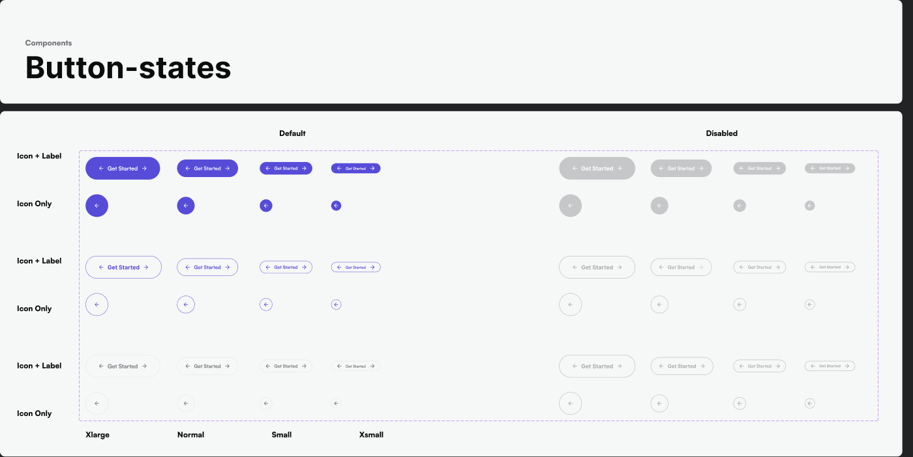

# Buttons

Source: Style Guide canvas → Base Components → Button (`node 1326:36046`), Button-states (`node 1326:35837`).

## Sizes

| Size | Text style |
|---|---|
| Xlarge | `Mobile App/Button/XL` (18px) |
| Normal | `Mobile App/Button/L` (16px) |
| Small | `Mobile App/Button/SM` (14px) |
| Xsmall | `Mobile App/Button/Mini` (12px) |

## Content variants

- **Icon + Label** — leading or trailing icon alongside text
- **Icon Only** — square icon button (use for compact toolbars, list-row actions)

## States

- **Default** — fill `Button/Primary-default` = `Primary/500` (`#564cd8`), label `White`
- **Disabled** — reduced-opacity/neutral fill, non-interactive

(Hover/pressed states weren't separately labeled in the file's metadata — infer standard patterns: pressed = darken fill one ramp step, e.g. `Primary/600`; disabled = `Grey/200` fill with `Grey/400` label, per the neutral ramp roles documented in [colors.md](../tokens/colors.md).)

## Variants (by role — infer from the color system, confirm against PRD/Figma before building)

Follow the same primary/secondary/tertiary pattern implied by the ramps: a **primary** button uses `Primary/500` fill + white label; a **secondary** button likely uses `Secondary/500` or an outlined `Primary` treatment; a **destructive** action uses the `Error` ramp (`Error/500` fill or outline). Confirm the exact secondary/outline/ghost treatment against the live Figma node before shipping — the metadata pass captured the primary-filled variant explicitly but not every button skin.

## Building a button in code

1. Pick size → matching `Mobile App/Button/*` type token.
2. Pick fill → `Primary/500` (primary), semantic ramp `500` (destructive/status), or an outlined/ghost treatment using `Elements/Stroke` for the border.
3. Radius → `normal` (16px) for standard buttons, `XLarge` (120px) for pill/rounded buttons.
4. Icon (if any) → Iconsax `linear` or `bold` style, sized to match the text line-height, colored to match the label (white on filled, `Primary/500` on outline/ghost).
5. Disabled state → drop opacity or swap to neutral `Grey/200` fill / `Grey/400` text; never leave a disabled button at full-opacity brand color.
