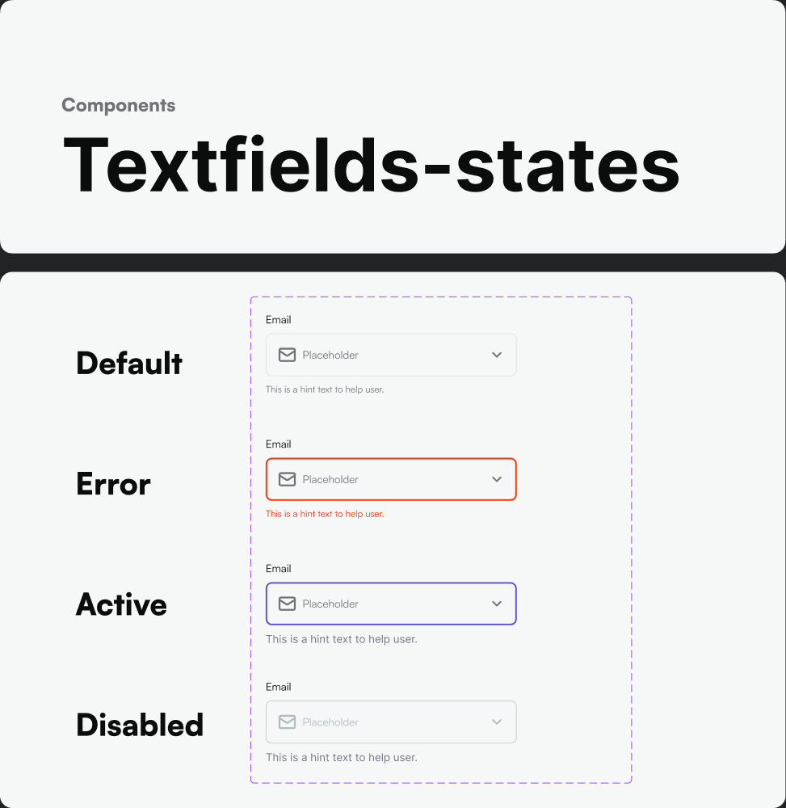

# Form Controls

Source: Base Components — Textfield (`1326:35800`, `1326:35818`, `1326:35837`, `1326:35959`, `1326:35977`, `1326:35993`), Textarea (`1326:36015`, `1326:36032`), Checkbox (`1326:36055`), Radio Button (`1326:36104`), Switch (`1326:36122`), Search (`node under Textfield 6`).

## Text field

**States:** Default, Error, Active (focused), Disabled.

**Layout variants** (compose these — a field can combine several):
- Leading Icon + Trailing Icon + Label + Hint text
- Leading Icon + Label + Hint text
- Leading Icon + Label
- Trailing Icon + Label
- Trailing Icon + Label + Hint text
- Placeholder only (no label)

**Token bindings (confirmed from the file):**
- Background: `Cards/Grey-card` (`Grey/50`, `#f6f7f7`)
- Border/stroke: `Elements/Stroke` (`Grey/100`, `#e3e3e4`)
- Icon: `Elements/Icon` (`Grey/500`, `#717477`)
- Label/value text: `Body2/Regular` (14px) or `Body3/Regular` (12px) depending on density
- Error state text/border: `Texts/Error action` / `Error/500` (`#ff2e00`)
- Focused/active border: `Primary/500` (`#564cd8`) is the expected accent (brand primary used across interactive states elsewhere in the file)

**Search field** is a dedicated variant of the text field (`Search`, node `1326:35993`) — same tokens, typically leading search icon + placeholder-only layout, no label.

## Textarea

Same token language as the text field. Variants:
- Label + Count + Hint text
- Label + Hint
- Label + Count
- Label only
- Placeholder only

Use the character-count variant for any field with a max-length constraint (bios, notes, support messages).

## Checkbox

Fill/accent when checked: `Primary/500`. Unchecked: outline in `Elements/Stroke`, background `Cards/Grey-card`. Label uses `Body2/Regular` + `Texts/Main`.

## Radio button

Same token pattern as checkbox — `Primary/500` for the selected indicator, `Elements/Stroke` for the unselected ring.

## Switch (toggle)

On state: track fill `Primary/500` (or `Primary/50`→`Primary/500` depending on knob-vs-track treatment), off state: `Grey/200`/`Elements/Stroke` track. White knob at both states.

## Menu / Dropdown inputs

Source: `Menu_Dropdown_Base` (`1326:36233`), `Input_dropdown` (`1326:36308`), `Menu_Dropdown` (`1326:36319`).

These compose a text-field-style trigger (same tokens as above) with a popover menu list on open:
- Popover surface: `White`, elevation `Dropshadow/sm` (see [elevation](../tokens/spacing-radius-elevation.md))
- Selected/hover row: `Primary/50` background
- List item text: `Body2/Regular`, `Texts/Main`

## Tooltip

Source: `1326:36139`. Dark/inverted surface expected (standard tooltip pattern) with `sm` elevation; not fully captured in metadata — verify exact background against Figma before implementing (likely `Grey/900` fill, `White` text, given it's the only dark-surface component in the kit).

## Building a form field in code

1. Container: background `Cards/Grey-card`, border `Elements/Stroke`, radius `normal` (16px), padding `$spacing-normal`/`$spacing-sm` between icon/label/input.
2. Label: `Body2/Regular` (14px), color `Texts/Main`.
3. Helper/hint text: `Body3/Regular` (12px), color `Texts/Sub`.
4. Icons: Iconsax `linear`, color `Elements/Icon`, swap to `Primary/500` on focus if the design calls for it.
5. Error state: border + hint text switch to `Texts/Error action` (`Error/500`); keep the same layout, just recolor.
6. Disabled state: reduce opacity or swap text/icon color to `Grey/300`/`Grey/400`.
