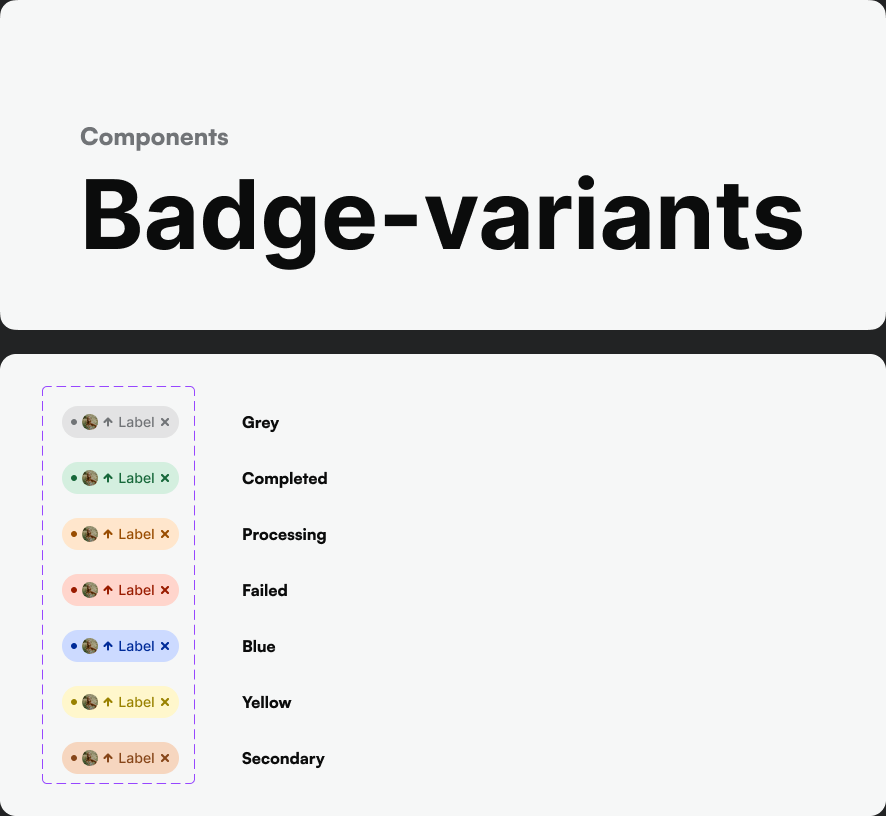
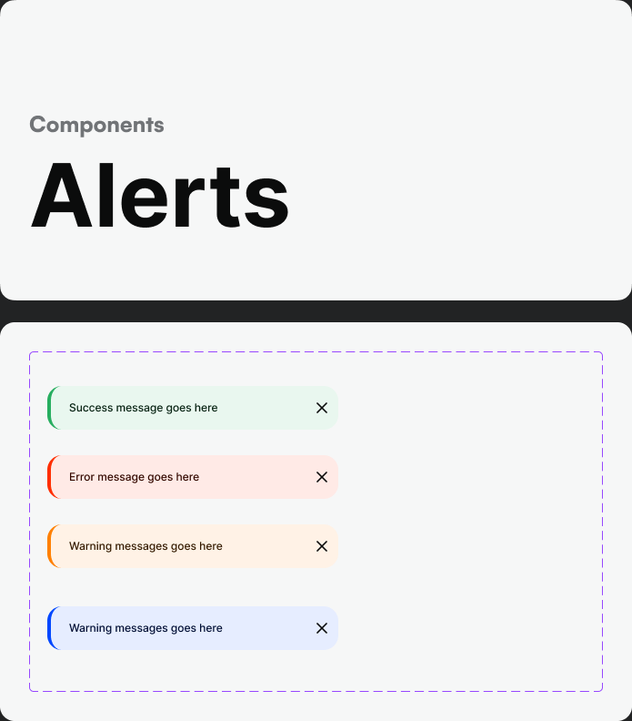

# Status, Badges & Alerts

Source: Base Components — Badge (`1507:4167`, `1507:4198`), Alerts (`1326:36421`, `1326:36451` "Profile").

## Badges (status pills)

Confirmed variants: **Grey, Completed, Processing, Failed, Blue, Yellow, Secondary.**

All badges follow the same recipe — background `{ramp}/100`, text `{ramp}/700`:

| Variant | Maps to ramp | Background | Text |
|---|---|---|---|
| Completed | Success | `Success/100` (`#d4efdf`) | `Success/700` (`#17683a`) |
| Processing | Warning | `Warning/100` (`#ffe6cc`) | `Warning/700` (`#994d01`) |
| Failed | Error | `Error/100` (`#ffd5cc`) | `Error/700` (`#991c00`) |
| Blue | Blue | `Blue/100` (`#ccdaff`) | `Blue/700` (`#002b99`) |
| Yellow | Yellow | `Yellow/100` (`#fff7cc`) | `Yellow/700` (`#998200`) |
| Secondary | Secondary | `Secondary/100` (`#f6d6bf`) | `Secondary/700` (`#864619`) |
| Grey | Grey (neutral) | `Grey/100` (`#e3e3e4`) | `Grey/900` (`#0b0c0c`) |

Radius: `XLarge` (120px, full pill). Text style: `Body3/Bold` (12px) or `Caption/Bold` (10px) depending on badge size.

**New status values:** if a PRD introduces a new status (e.g. "Refunded", "On Hold"), map its semantic meaning to the closest existing ramp — don't invent a new color. Success-like → green, in-progress → warning/orange, failure-like → error/red, neutral/info → blue or grey.

## Alerts

Confirmed semantic pattern (background/icon/text triple), consistent with badges but using the lighter `50` step for background since alerts are larger surfaces:

| Type | Background | Icon | Text |
|---|---|---|---|
| Success | `Success/50` | `Success/500` | `Success/900` |
| Error | `Error/50` | `Error/500` | `Error/900` |
| Warning | `Warning/50` | `Warning/500` | `Warning/900` |
| Info | `Blue/50` | `Blue/500` | `Blue/900` |

Layout: leading status icon (Iconsax `bold` or `bulk` for visual weight) + message text (`Body2/Regular`), optional trailing dismiss icon. Radius `normal` (16px), no elevation (alerts sit flat within page flow) unless used as a toast, in which case apply `md` elevation.

## Building a status/feedback component in code

1. Resolve the semantic intent (success/error/warning/info/neutral) — never pick a color by "what looks nice," always by ramp role.
2. Badge → `{ramp}/100` bg + `{ramp}/700` text + pill radius.
3. Alert → `{ramp}/50` bg + `{ramp}/500` icon + `{ramp}/900` text + `normal` radius.
4. Toast (alert + elevation) → same as alert, add `md` shadow, position per platform convention (top or bottom of screen).
