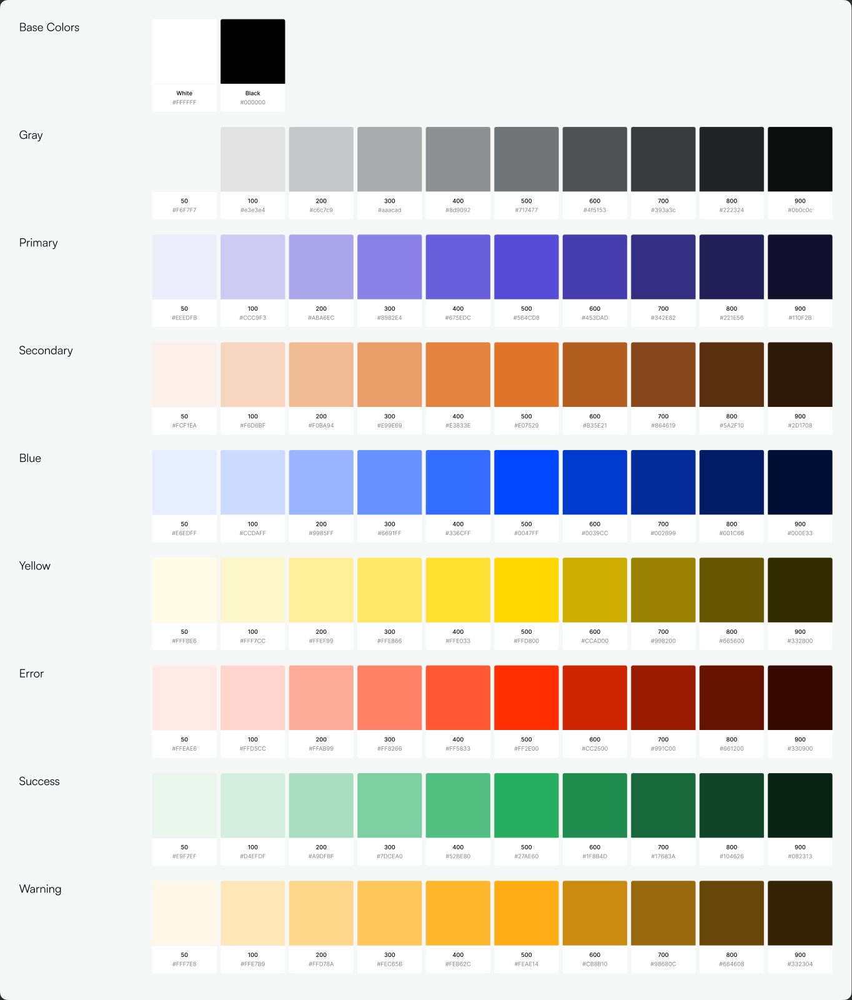

# Color Tokens

Source: Figma "Kwikpik Web3" file, Style Guide canvas → Foundation section → Colors (`node 1326:31330`) and the Semantics token tables (`Cards` frames under Foundation, nodes `1326:34538`–`1326:35509`).

## Naming convention

Two naming schemes appear in the file and both resolve to the same hex per ramp (except Warning — see "Known inconsistency" below):

- **Variable form** (bound to components): `Color/{Ramp}/{step}`, e.g. `Color/Primary/500`
- **Legacy/spec form** (used in the printed token tables): `$Ramp-step`, e.g. `$Primary-500`

When generating code, emit tokens using the variable form (`color.primary.500`, etc.) — it's what's actually wired to live components via Figma variables.

## Neutral / Gray ramp

| Token | Hex | Role (as documented) |
|---|---|---|
| `Grey/50` | `#f6f7f7` | surface |
| `Grey/100` | `#e3e3e4` | border, highlight-card |
| `Grey/200` | `#c6c7c9` | — |
| `Grey/300` | `#aaacad` | — |
| `Grey/400` | `#8d9092` | sub, icon |
| `Grey/500` | `#717477` | — |
| `Grey/600` | `#4f5153` | — |
| `Grey/700` | `#393a3c` | sub text |
| `Grey/800` | `#222324` | — |
| `Grey/900` | `#0b0c0c` | text |
| `White` | `#ffffff` | main-card, modal, nav |
| `Black` | `#000000` | — |

## Primary ramp (brand purple)

| Token | Hex | Role |
|---|---|---|
| `Primary/50` | `#eeedfb` | surface |
| `Primary/100` | `#ccc9f3` | |
| `Primary/200` | `#aba6ec` | |
| `Primary/300` | `#8982e4` | |
| `Primary/400` | `#675edc` | |
| `Primary/500` | `#564cd8` | **action-button, action-text** (primary brand color) |
| `Primary/600` | `#453dad` | |
| `Primary/700` | `#342e82` | |
| `Primary/800` | `#221e56` | |
| `Primary/900` | `#110f2b` | text |

`Primary/500` (`#564cd8`) is the default primary button fill (`Button/Primary-default`) — treat it as the canonical brand accent.

## Secondary ramp (brand orange)

| Token | Hex | Role |
|---|---|---|
| `Secondary/50` | `#fcf1ea` | surface |
| `Secondary/100` | `#f6d6bf` | |
| `Secondary/200` | `#f0ba94` | |
| `Secondary/300` | `#e99e69` | |
| `Secondary/400` | `#e3833e` | |
| `Secondary/500` | `#e07529` | action-button, action-text |
| `Secondary/600` | `#b35e21` | |
| `Secondary/700` | `#864619` | |
| `Secondary/800` | `#5a2f10` | |
| `Secondary/900` | `#2d1708` | text |

## Blue ramp (info / links)

| Token | Hex | Role |
|---|---|---|
| `Blue/50` | `#e6edff` | surface |
| `Blue/100` | `#ccdaff` | |
| `Blue/200` | `#99b5ff` | |
| `Blue/300` | `#6691ff` | |
| `Blue/400` | `#336cff` | |
| `Blue/500` | `#0047ff` | action-button, action-text |
| `Blue/600` | `#0039cc` | |
| `Blue/700` | `#002b99` | |
| `Blue/800` | `#001c66` | |
| `Blue/900` | `#000e33` | text-light |

## Yellow ramp

| Token | Hex | Role |
|---|---|---|
| `Yellow/50` | `#fffbe6` | surface |
| `Yellow/100` | `#fff7cc` | |
| `Yellow/200` | `#ffef99` | |
| `Yellow/300` | `#ffe866` | |
| `Yellow/400` | `#ffe033` | |
| `Yellow/500` | `#ffd800` | action-button, action-text |
| `Yellow/600` | `#ccad00` | |
| `Yellow/700` | `#998200` | |
| `Yellow/800` | `#665600` | |
| `Yellow/900` | `#332b00` | text-light |

## Semantic ramps

### Error (destructive / failure)
| Token | Hex |
|---|---|
| `Error/50` | `#ffeae6` |
| `Error/100` | `#ffd5cc` |
| `Error/200` | `#ffab99` |
| `Error/300` | `#ff8266` |
| `Error/400` | `#ff5833` |
| `Error/500` | `#ff2e00` |
| `Error/600` | `#cc2500` |
| `Error/700` | `#991c00` |
| `Error/800` | `#661200` |
| `Error/900` | `#330900` |

### Success
| Token | Hex |
|---|---|
| `Success/50` | `#e9f7ef` |
| `Success/100` | `#d4efdf` |
| `Success/200` | `#a9dfbf` |
| `Success/300` | `#7dcea0` |
| `Success/400` | `#52be80` |
| `Success/500` | `#27ae60` |
| `Success/600` | `#1f8b4d` |
| `Success/700` | `#17683a` |
| `Success/800` | `#104626` |
| `Success/900` | `#082313` |

### Warning ⚠️ (see known inconsistency below — use this ramp)
| Token | Hex |
|---|---|
| `Warning/50` | `#fff2e6` |
| `Warning/100` | `#ffe6cc` |
| `Warning/200` | `#ffcc99` |
| `Warning/300` | `#ffb367` |
| `Warning/400` | `#ff9934` |
| `Warning/500` | `#ff8001` |
| `Warning/600` | `#cc6601` |
| `Warning/700` | `#994d01` |
| `Warning/800` | `#663300` |
| `Warning/900` | `#331a00` |

## Semantic usage pattern (badges, alerts, status pills)

Every status color in the components (Badge, Alert, Profile status) follows the same 3-step pattern:

- **Background** → `{ramp}/50` or `{ramp}/100`
- **Icon / accent** → `{ramp}/500`
- **Text** → `{ramp}/700` or `{ramp}/900`

Confirmed live bindings from the Alert and Badge components:
- Success: bg `Success/50`, icon `Success/500`, text `Success/900`
- Error/Failed: bg `Error/50`/`Error/100`, icon `Error/500`, text `Error/900`/`Error/700`
- Warning/Processing: bg `Warning/50`/`Warning/100`, icon `Warning/500`, text `Warning/900`/`Warning/700`
- Info (Blue): bg `Blue/50`/`Blue/100`, icon `Blue/500`, text `Blue/900`/`Blue/700`
- Neutral (Grey/Completed): bg `Grey/50`, text `Grey/900`

Reuse this 50/100 → 500 → 700/900 pattern for any new status/tag UI instead of inventing new colors.

## Semantic text/element aliases

These are the aliases actually bound inside components — prefer them over raw ramp values when they exist:

| Alias | Resolves to | Use |
|---|---|---|
| `Texts/Main` | `#0b0c0c` (`Grey/900`) | primary text |
| `Texts/Sub` | `#717477` (`Grey/500`) | secondary/sub text |
| `Texts/Sub-text` | `#727c83` | tertiary/helper text |
| `Texts/Error action` | `#ff2e00` (`Error/500`) | inline error/link text |
| `Elements/Stroke` | `#e3e3e4` (`Grey/100`) | borders/dividers |
| `Elements/Icon` | `#717477` (`Grey/500`) | default icon fill |
| `Cards/Grey-card` | `#f6f7f7` (`Grey/50`) | card/section background |
| `Button/Primary-default` | `#564cd8` (`Primary/500`) | primary button fill |

## Known inconsistency — flag for design team

The file defines **two different Warning scales**:

1. `Foundation → Colors` node (`1326:31330`) has a `Color/Warning/*` variable set starting at `#fffbe6`… `#feae14` (500) — this looks like an amber/gold scale.
2. The `Semantics → Warning Tokens` table and the actual **Alert/Badge components** are bound to a **different** `Color/Warning/*` set starting at `#fff2e6`… `#ff8001` (500) — an orange scale.

Since the live components reference the **orange** scale (`#ff8001` family), that is documented above as canonical. Confirm with design before shipping new work that relies on Warning colors, and ask them to delete or rename the unused amber ramp to avoid future confusion.
