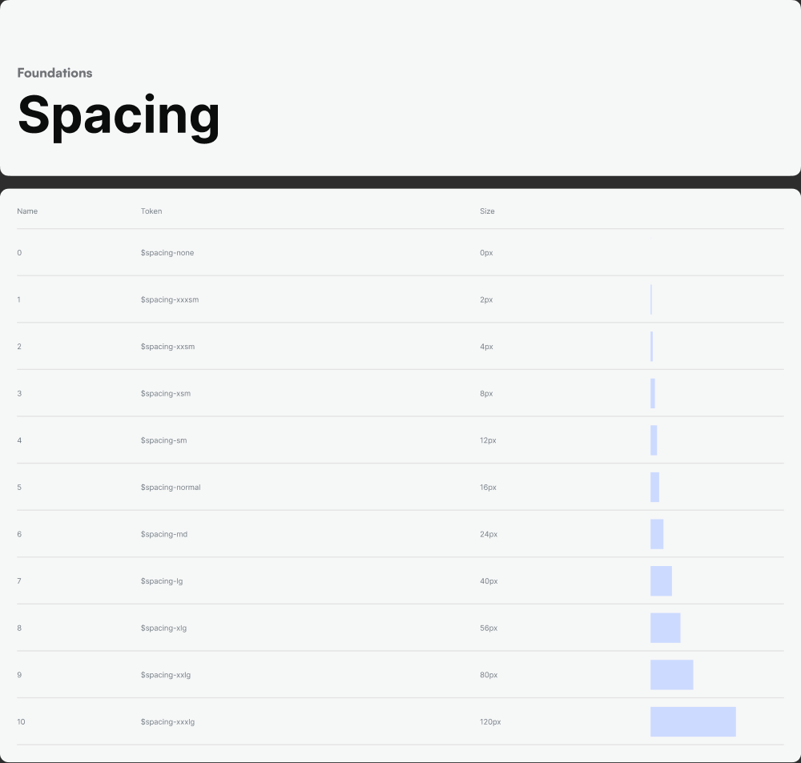

# Spacing, Radius & Elevation

Source: Style Guide canvas → Foundation → Spacing (`node 1326:35667`), Radius (`node 1326:35757`), Shadows (`node 1326:35646`).

## Spacing scale

An 8px-leaning scale with two small sub-8 steps for tight UI (icon gaps, chip padding):

| Step | Token | Size |
|---|---|---|
| 0 | `$spacing-none` | 0px |
| 1 | `$spacing-xxxsm` | 2px |
| 2 | `$spacing-xxsm` | 4px |
| 3 | `$spacing-xsm` | 8px |
| 4 | `$spacing-sm` | 12px |
| 5 | `$spacing-normal` | 16px |
| 6 | `$spacing-md` | 24px |
| 7 | `$spacing-lg` | 40px |
| 8 | `$spacing-xlg` | 56px |
| 9 | `$spacing-xxlg` | 80px |
| 10 | `$spacing-xxxlg` | 120px |

**Usage rule of thumb:**
- `xxxsm`/`xxsm` (2–4px) — icon-to-label micro gaps, badge internal padding
- `xsm`/`sm` (8–12px) — control internal padding, gaps between related elements (form field to helper text)
- `normal`/`md` (16–24px) — default screen/card padding, gaps between distinct components
- `lg`–`xxxlg` (40–120px) — section separation, empty-state spacing, screen top/bottom margins

Note: a separate numeric variable alias set (`Spacing/1`, `Spacing/2`, `Spacing/3`… bound directly to some components) does **not** map 1:1 to the step numbers above (e.g. a component used `Spacing/1 = 4px` and `Spacing/3 = 8px`, which line up with `xxsm`/`xsm` by *value*, not by index). **Always match by pixel value against the named tokens above**, not by the numeric suffix.

## Border radius scale

| Name | Size |
|---|---|
| Xsm | 4px |
| sm | 8px |
| normal | 16px |
| Large | 24px |
| XLarge | 120px (fully-rounded / pill, e.g. avatars, circular buttons) |

Default control radius (buttons, inputs, cards) is `normal` (16px) unless the component is a pill/chip/avatar, which uses `XLarge` (120px) to force a full round.

## Elevation / shadow scale

All shadows are single drop-shadows, color `#0D0B0E` (near-black) at varying opacity, softer/larger as elevation increases:

| Token | Offset (x, y) | Blur radius | Spread | Opacity |
|---|---|---|---|---|
| `xs` | 0, 4 | 10 | 5 | ~4% (`0A`) |
| `sm` | 0, 4 | 20 | 10 | ~5% (`0D`) |
| `md` | 0, 5 | 30 | 10 | ~7% (`12`) |
| `normal` | 0, -5 | 30 | 0 | ~10% (`1A`), color `#17181B` — **upward** shadow, used for bottom sheets/nav bars sitting above content |
| `lg` | 0, 10 | 50 | 10 | ~10% (`1A`) |
| `xl` | 0, 20 | 50 | 20 | ~10% (`1A`) |
| `xxl` | 0, 30 | 60 | 30 | ~10% (`1A`) |

**Usage rule of thumb:**
- `xs`/`sm` — resting cards, list items
- `md` — dropdowns, popovers, tooltips
- `lg`/`xl` — modals, dialogs
- `xxl` — full-screen overlays / bottom sheets at rest
- `normal` (the upward variant) — sticky bottom bars, bottom sheets, tab bars

CSS equivalent for `md`, as an example: `box-shadow: 0 5px 30px 10px rgba(13, 11, 14, 0.07);`
