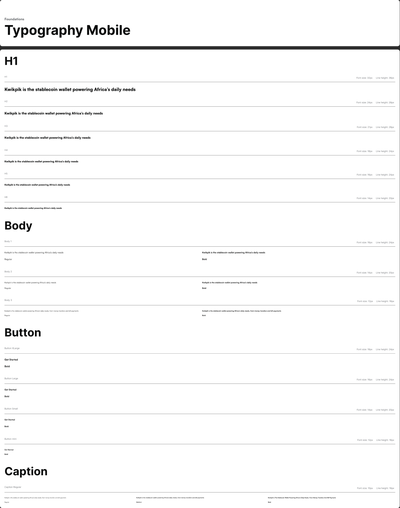

# Typography

Source: Style Guide canvas → Foundation → "Typography Mobile" (`node 1326:31034`), variable defs pulled directly from Figma. Desktop/web scale lives in the separate `Typography` frame (`node 1:58`).

## Font families

| Family | Used for |
|---|---|
| **Satoshi** | Mobile app UI — all headings, body, buttons, captions. This is the primary product font. |
| **Inter** | A handful of secondary/legacy text styles (`Mobile/Body3/Regular`, `Mobile/Body4/Regular`, `Mobile/Body1/Regular`). Treat Satoshi as the default for new mobile work unless a spec explicitly calls for Inter. |

Both are variable/geometric sans faces — verify licensing and that the weights below (Black/900, Bold/700, Regular/400) are the actual font files bundled in the app before implementing.

## Mobile app text styles (use these token names 1:1 in code)

| Token | Family | Weight | Size | Line height | Letter spacing |
|---|---|---|---|---|---|
| `Mobile App/H1` | Satoshi | Black (900) | 32px | 32px | 0 |
| `Mobile App/H2` | Satoshi | Black (900) | 24px | 32px | 0 |
| `Mobile App/H3` | Satoshi | Black (900) | 21px | 28px | 0 |
| `Mobile App/H4` | Satoshi | Black (900) | 18px | 24px | 0 |
| `Mobile App/H5` | Satoshi | Black (900) | 16px | 24px | 0 |
| `Mobile App/H6` | Satoshi | Black (900) | 14px | 20px | 0 |
| `Mobile App/Body1/Regular` | Satoshi | Regular (400) | 16px | 24px | 0 |
| `Mobile App/Body1/Bold` | Satoshi | Bold (700) | 16px | 24px | 0 |
| `Mobile App/Body2/Regular` | Satoshi | Regular (400) | 14px | 20px | 0 |
| `Mobile App/Body2/Bold` | Satoshi | Bold (700) | 14px | 20px | 0 |
| `Mobile App/Body3/Regular` | Satoshi | Regular (400) | 12px | 16px | 0 |
| `Mobile App/Body3/Bold` | Satoshi | Bold (700) | 12px | 16px | 0 |
| `Mobile App/Caption/Regular` | Satoshi | Regular (400) | 10px | 16px | 0 |
| `Mobile App/Caption/Bold` | Satoshi | Bold (700) | 10px | 16px | 0 |
| `Mobile App/Button/XL` | Satoshi | Bold (700) | 18px | 24px | 0 |
| `Mobile App/Button/L` | Satoshi | Bold (700) | 16px | 24px | 0 |
| `Mobile App/Button/SM` | Satoshi | Bold (700) | 14px | 24px | 0 |
| `Mobile App/Button/Mini` | Satoshi | Bold (700) | 12px | 16px | 0 |

Usage convention: pick the smallest style that fits — `H1`–`H6` for headings/titles, `Body1`–`Body3` for content (1 = largest/16px, 3 = smallest/12px), `Caption` for helper/meta text, and the matching `Button/*` size for button labels (always Bold).

## Secondary/legacy styles (Inter, encountered on a few frames)

| Token | Family | Weight | Size | Line height |
|---|---|---|---|---|
| `Mobile/Body1/Regular` | Inter | Regular | 21px | 28px |
| `Mobile/Body3/Regular` | Inter | Regular | 16px | 24px |
| `Mobile/Body4/Regular` | Inter | Regular | 14px | 20px |

These show up on a couple of foundation/utility frames only — don't use them for new screens; prefer the `Mobile App/*` Satoshi styles above.

## Display scale — website headlines (Aeonik, node `1122:358`)

**Confirmed live 2026-09-27** by sampling real text nodes on the
`👩🏽‍🎨 Website Remodel` Figma page (not the desktop scale below, which is
unused legacy). The marketing website's headline font is **Aeonik Bold**,
completely separate from Satoshi — Satoshi only appears there as body
copy (`Regular`, 16px, 1,468 uses — by far the most common size on that
page) and two minor accent uses (32px/21px `Black`). The `Mobile App`
scale above (which tops out at 32px) was never meant for website
headlines; this is why it looked broken/too small when tried on the site.

| Token | Size | Line height | Weight | Real usage count |
|---|---|---|---|---|
| `Display/2xl` | 88px | 88px (100%) | Bold (700) | 29 — hero headline |
| `Display/xl` | 72px | 72px (100%) | Bold (700) | 98 — section headline ("Why People Love Using Kwikpik") |
| `Display/l` | 56px | 56px (100%) | Bold (700) | 42 — subsection headline |
| `Display/m` | 40px | 40px (100%) | Bold (700) | 160 — most common display size, feature headline |
| `Display/s` | 24px | 32px (133%) | Bold (700) | 264 — small headline / large body |
| `Display/xs` | 18px | 24px (133%) | Bold (700) | 272 — eyebrow / label heading |

Line-heights are the **real values read off the nodes**, not an assumed
ratio — every size 40px and up uses tight 100% line-height (part of the
"oversized confident" brand voice, see
[[feedback-check-brand-sources-before-designing]]); only the two smallest
sizes use a normal ~133% line-height.

**Licensing caveat:** Aeonik is a commercial typeface (Cotype Foundry) —
confirm a webfont license/hosting arrangement (self-hosted `.woff2` or a
service like Fonshare) exists before shipping it on the live site. Code
implementation: `packages/ui/src/styles/tokens.css` (`--font-display`,
`--text-display-*`), exposed as Tailwind utilities `font-display
text-display-2xl` etc. Falls back to Satoshi if the Aeonik font file
isn't loaded, so the site degrades gracefully rather than breaking.

Two other fonts appear on the website page but are **not** part of the
system — flagged, not adopted: `Instrument Sans` (Medium) on currency
figures (`$`/`₦` glyphs in illustrative screenshots) and `Geist Mono`
(Bold) on one stat counter. Treat these as one-off illustration content,
not reusable type tokens, unless a designer confirms otherwise.

## Desktop/Web scale (reference only — from `node 1:58`, if a web surface is ever needed)

| Style | Size | Line height | Weight | Letter spacing |
|---|---|---|---|---|
| H1 | 24px | 32px | 500 (Medium) | 0% |
| H2 | 20px | 24px | 500 (Medium) | 0% |
| H3 | 18px | 24px | 500 (Medium) | 0% |
| H4 | 16px | 24px | 600 (Semibold) | 0% |
| H5 | 14px | 20px | 600 (Semibold) | 0% |
| H6 | 12px | 16px | 600 (Semibold) | 2% |
| S1 (Subheading) | 16px | 24px | 500 (Medium) | 0% |
| S2 (Subheading) | 14px | 20px | 500 (Medium) | 0% |
| B1 (Body) | 16px | 24px | 400 (Regular) | 0% |
| B2 (Body) | 14px | 20px | 400 (Regular) | 0% |
| Caption — Medium | 12px | 16px | 500 (Medium) | 2% |
| Caption — Regular | 12px | 16px | 500 (Medium) | 2% |
| Overline | 10px | 12px | 500 (Medium) | 4% |

Note the desktop scale uses a different weight vocabulary (Medium/Semibold, sentence-style H1–H6/S1–S2/B1–B2/Caption/Overline) than the mobile scale (Black/Bold, `Mobile App/*` tokens). **For mobile feature work, always use the Mobile App scale above** — the desktop scale is a separate, lighter-weight system for web.

## Text color pairing

Pair type styles with the semantic text color aliases, not raw hex:
- Primary/heading text → `Texts/Main` (`#0b0c0c`)
- Secondary/supporting text → `Texts/Sub` (`#717477`)
- Tertiary/helper text → `Texts/Sub-text` (`#727c83`)
- Inline error/link → `Texts/Error action` (`#ff2e00`)

See [colors.md](./colors.md) for the full ramp.
